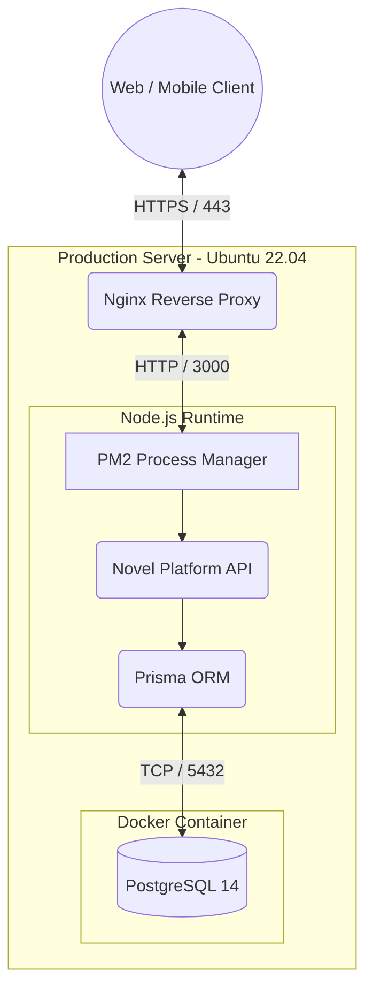
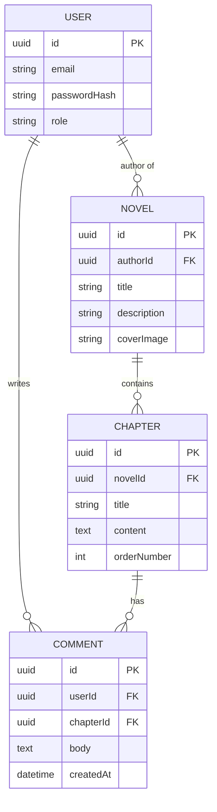
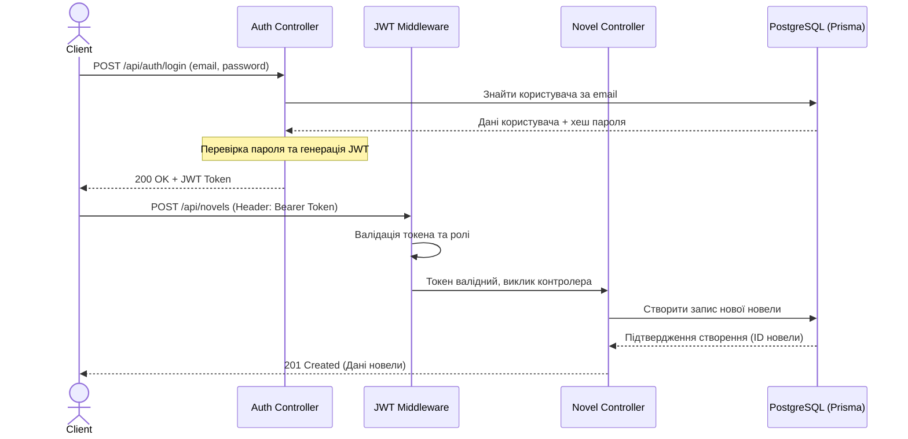

# Архітектура та діаграми проєкту (Лабораторна робота №6)

## 1. Тема та deliverables бакалаврської роботи
**Тема:** Розробка веб-платформи для публікації, читання та обговорення новел (Novel Platform).

**Основні deliverables (результати):**
1. **RESTful API (Backend):** Серверна частина на базі Node.js, TypeScript та Express/Koa.
2. **База даних:** Спроєктована реляційна БД PostgreSQL, керована через Prisma ORM.
3. **Клієнтська частина:** Веб-інтерфейс для користувачів системи.
4. **Документація:** Архітектурні діаграми, інструкції з розгортання та API-специфікація.

---

## 2. Теоретичний опис альтернатив типів діаграм (9 видів)

### Категорія 1: Структурні діаграми
Відображають статичну структуру системи.
1. **Component Diagram (Нотація: UML 2.0)**
    * **Опис:** Показує організацію та залежності між фізичними компонентами ПЗ. [1]
    * **Переваги:** Допомагає розбити складну систему на мікросервіси/модулі.
    * **Недоліки:** Не показує взаємодію у часі або бізнес-логіку.
2. **Deployment Diagram (Нотація: UML 2.0)**
    * **Опис:** Ілюструє фізичне розгортання артефактів на серверах або контейнерах. [2]
    * **Переваги:** Ідеально підходить для DevOps, чітко показує мережеві зв'язки.
    * **Недоліки:** Швидко застаріває при частих змінах хмарної інфраструктури.
3. **Class Diagram (Нотація: UML 2.0)**
    * **Опис:** Відображає класи ООП-системи, їх атрибути, методи та зв'язки. [1]
    * **Переваги:** Детально описує архітектуру коду, основа для кодогенерації.
    * **Недоліки:** Перевантажена для великих систем, складна для нетехнічних спеціалістів.

### Категорія 2: Діаграми даних
Використовуються для моделювання структур збереження інформації.
1. **ER-діаграма (Нотація: Crow's Foot)**
    * **Опис:** Показує сутності (таблиці) та зв'язки між ними. [3]
    * **Переваги:** Стандарт для проєктування реляційних БД (PostgreSQL).
    * **Недоліки:** Не підходить для NoSQL баз даних.
2. **Schema Diagram (Нотація: Relational Model)**
    * **Опис:** Фізичне представлення БД, що включає типи даних, PK та FK. [4]
    * **Переваги:** Максимально наближена до SQL-коду.
    * **Недоліки:** Занадто деталізована, приховує загальну концепцію.
3. **Object Diagram (Нотація: UML 2.0)**
    * **Опис:** Відображає знімок об'єктів системи у певний момент часу. [1]
    * **Переваги:** Допомагає тестувати Class Diagrams на реальних прикладах.
    * **Недоліки:** Показує лише один сценарій (snapshot).

### Категорія 3: Діаграми поведінки та взаємодії
Описують динамічні процеси системи.
1. **Sequence Diagram (Нотація: UML 2.0)**
    * **Опис:** Показує взаємодію об'єктів у хронологічному порядку обміну повідомленнями. [1]
    * **Переваги:** Незамінна для проєктування REST API та мікросервісів.
    * **Недоліки:** Швидко стає нечитабельною при великій кількості учасників.
2. **Activity Diagram (Нотація: UML 2.0)**
    * **Опис:** Показує потік управління від однієї активності до іншої (як блок-схема). [2]
    * **Переваги:** Чудово підходить для опису складних бізнес-алгоритмів.
    * **Недоліки:** Не завжди чітко показує відповідальність конкретного компонента.
3. **Use Case Diagram (Нотація: UML 2.0)**
    * **Опис:** Відображає взаємодію між користувачами та функціями системи. [1]
    * **Переваги:** Найкращий інструмент для збору вимог.
    * **Недоліки:** Не розкриває технічну реалізацію.

---

## 3. Практична реалізація (Вихідний код та візуалізація)

### 3.1. Deployment Diagram (Структурна категорія)
**Обґрунтування:** Візуалізує розгортання Node.js бекенду з використанням PM2, Nginx та PostgreSQL, що логічно продовжує попередні роботи з CI/CD та налаштування серверів.

### 3.2. ER-діаграма (Категорія даних)
Обґрунтування: Оскільки проєкт використовує Prisma ORM та PostgreSQL, ER-діаграма у нотації Crow's Foot найкраще відображає концептуальні зв'язки між користувачами, новелами та розділами.

### 3.3. Sequence Diagram (Категорія поведінки)
Обґрунтування: Показує критичний для бекенду процес — авторизацію користувача та отримання доступу до захищеного ендпоінту з використанням JWT токена.

